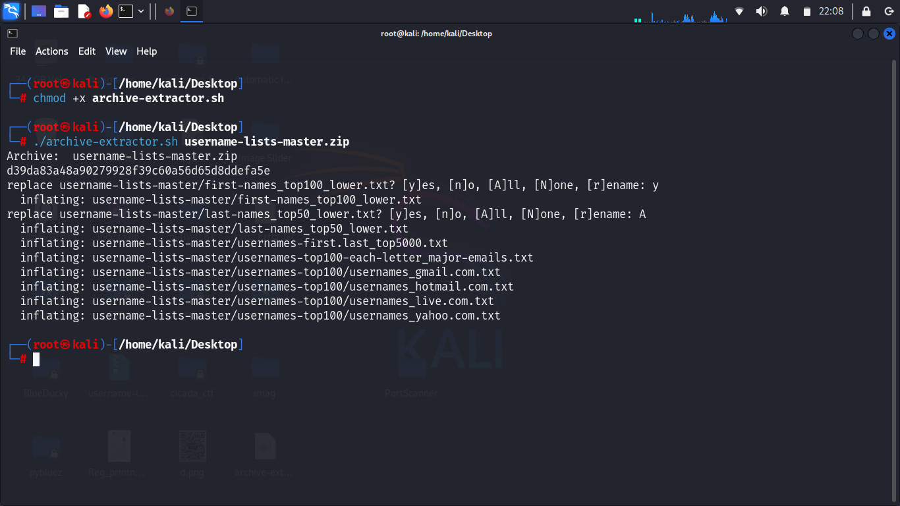

# All-type-ZIP-RAR-Extractor
```
git clone https://github.com/CryptoQuestVikas/All-type-ZIP-RAR-Extractor.git
cd All-type-ZIP-RAR-Extractor
chmod +x archive-extractor.sh
./archive-extractor.sh <your zip or rar 7z> support all type zip or rar
```

 # **Screenshot :**
 
